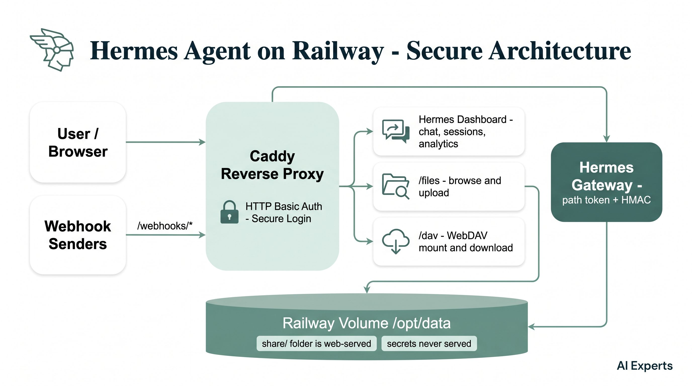
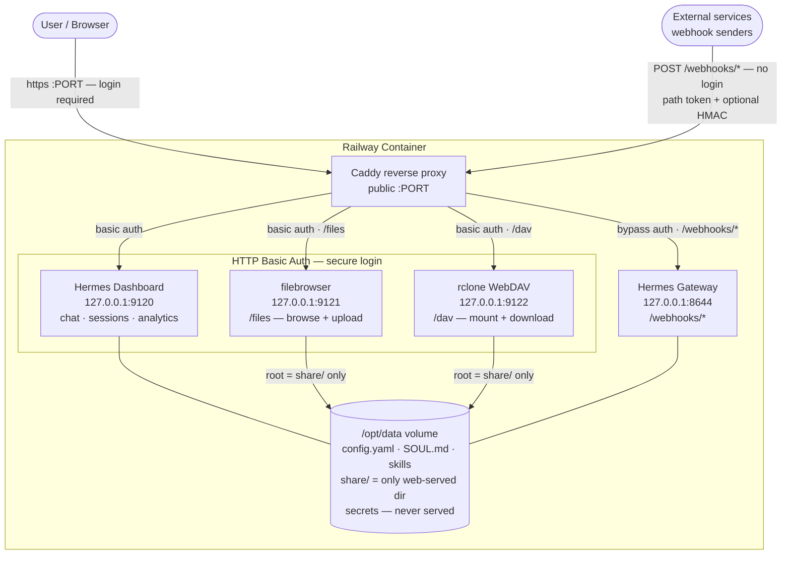

# hermes-railway

Minimal Railway deploy template for [Hermes Agent](https://github.com/NousResearch/hermes-agent), with HTTP basic auth in front of the native dashboard.

## What it does

- `FROM nousresearch/hermes-agent:latest` (the official upstream image)
- Boots `hermes gateway` and `hermes dashboard` (the full native Hermes dashboard - Chat tab, sessions, analytics, all of it)
- Puts a [Caddy](https://caddyserver.com/) HTTP basic-auth reverse proxy in front so the dashboard is not publicly accessible without credentials
- All state persists to the Railway volume at `/opt/data`

## Architecture

Everything public goes through **Caddy on `PORT`**. The dashboard, `/files`, and `/dav` sit behind **HTTP basic auth** (the secure login); only `/webhooks/*` bypasses it, guarded instead by a long random path token plus optional HMAC signature checks. `/files` (filebrowser) and `/dav` (rclone WebDAV) are both rooted at `share/` — the rest of the volume, including secrets, is never web-reachable.

## Env vars

| Var | Default | Notes |
|---|---|---|
| `DASHBOARD_USER` | `admin` | HTTP basic-auth username |
| `DASHBOARD_PASSWORD` | *(auto-generated)* | If unset, a 24-char random password is generated and printed to logs |
| `PORT` | `9119` | Public port (Railway sets this automatically) |
| `HERMES_HOME` | `/opt/data` | Volume mount path |
| `SKILLS_REPO_URL` | *(optional)* | HTTPS GitHub URL of a private skills repo to clone at boot (expects a top-level `skills/<name>/` layout) |
| `SKILLS_REPO_TOKEN` | *(optional)* | GitHub PAT (`contents: read`) used to clone `SKILLS_REPO_URL`. Both must be set to enable. |

## Deploy

1. Fork this repo or push it as your own.
2. On Railway, create a service from your GitHub fork.
3. Attach a volume mounted at `/opt/data`.
4. Set `DASHBOARD_USER` and `DASHBOARD_PASSWORD` env vars (optionally `SKILLS_REPO_URL` + `SKILLS_REPO_TOKEN`).
5. Deploy. On first boot the Caddy binary downloads to the volume (~40 MB) and caches there forever.

## Recommended skills & tools

The `nousresearch/hermes-agent` image already ships ~90 public skills — nothing to install, they're available the moment the agent boots. These are the ones worth knowing about (all public, none specific to any org):

**Software development**
- `claude-code`, `codex`, `opencode` — drive coding agents
- `codebase-inspection`, `systematic-debugging`, `test-driven-development`, `subagent-driven-development`
- `github-pr-workflow`, `github-code-review`, `github-issues`, `github-repo-management`, `requesting-code-review`

**Productivity & knowledge**
- `notion`, `linear`, `obsidian`, `airtable`, `google-workspace`
- `arxiv`, `research-paper-writing`, `plan` / `writing-plans`, `ocr-and-documents`, `nano-pdf`

**Creative & media**
- `powerpoint`, `manim-video`, `p5js`, `comfyui`, `youtube-content`, `gif-search`, `humanizer`

**Personal & comms** (macOS / accounts)
- `imessage`, `apple-notes`, `apple-reminders`, `findmy`, `spotify`, `maps`, `polymarket`

**Agent infrastructure**
- `hermes-agent-skill-authoring` — let the agent write its own skills
- `webhook-subscriptions` — pairs with the `/webhooks/*` routing this template sets up

Browse the full set in the dashboard, or have the agent run its skill hub. To add your **own private** skills, point `SKILLS_REPO_URL` + `SKILLS_REPO_TOKEN` at a repo with a `skills/<name>/` layout (see Env vars above).

### Optional MCP integrations (public services, bring your own API key)

Add these under `mcp_servers` in `$HERMES_HOME/config.yaml` to extend the agent. None are org-specific; each just needs your own key:

| Service | What it adds | Get a key |
|---|---|---|
| [Composio](https://composio.dev) | One tool router for 1000+ apps (Gmail, Slack, Calendar, CRMs…) | composio.dev |
| [Replicate](https://replicate.com) | Image / video / audio model inference | replicate.com |
| [AgentMail](https://agentmail.to) | Programmatic email inboxes for agents — pairs with the webhook routing here | agentmail.to |
| [Granola](https://granola.ai) | Meeting notes & transcripts | granola.ai |

## Rollback

If anything goes sideways, swap the `CMD` in the Dockerfile back to `/opt/hermes/railway-start.sh` (the upstream default) and redeploy. Auth disappears, native behaviour returns.
